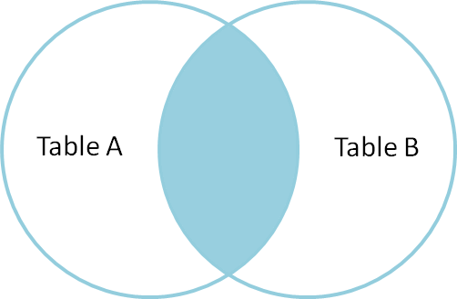
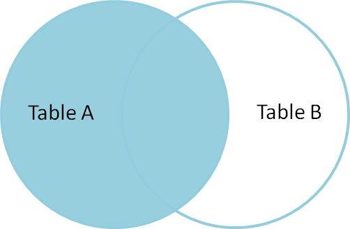

Table of Contents
=================

   * [MySQL查询](#mysql查询)
      * [阅读说明](#阅读说明)
      * [SQL逻辑查询语句执行顺序](#sql逻辑查询语句执行顺序)
      * [多表查询](#多表查询)
         * [多表联合查询](#多表联合查询)
         * [多表链接查询](#多表链接查询)
         * [复制条件多表查询](#复制条件多表查询)
         * [子语句查询](#子语句查询)
         * [其他方式查询](#其他方式查询)

Created by ALTA
# MySQL查询  

*<font color=#008000>绿色斜体</font>*代表个人的思考理解，*<font color=Yellow>黄色斜体</font>*代表阅读理解过程中的疑问，<font color=Red>红色正体</font>代表关键重要信息，<u>下划线</u>代表次关键重要信息`阴影`或 *一般斜体* 均表示引用或强调 

```python
# ---------------------------------- 输出结果
```

## SQL逻辑查询语句执行顺序  

参考文章[SQL逻辑查询语句执行顺序](https://www.cnblogs.com/wangfengming/articles/7880312.html)

```mysql
(7)     SELECT 
(8)     DISTINCT <select_list>
(1)     FROM <left_table>
(3)     <join_type> JOIN <right_table>
(2)     ON <join_condition>
(4)     WHERE <where_condition>
(5)     GROUP BY <group_by_list>
(6)     HAVING <having_condition>
(9)     ORDER BY <order_by_condition>
(10)    LIMIT <limit_number>
```

编号即为执行顺序号，在这些SQL语句的执行过程中，都会产生一个虚拟表，用来保存SQL语句的执行结果，跟踪这个虚拟表的变化，得到最终的查询结果的过程，即可分析整个SQL逻辑查询的执行顺序和过程

## 多表查询  

参考文章[多表查询](<https://www.cnblogs.com/bypp/p/8618382.html>)  

### 多表联合查询  

1. 不加条件直接进行查询,则会出现以下效果,这种结果我们称之为 **笛卡尔乘积** , A表中数据条数   *  B表中数据条数  = 笛卡尔乘积

   ```mysql
   select * from person,dept　
   ```

2. 多表查询时,一定要找到两个表中相互关联的字段,并且作为条件使用

   ```mysql
   select * from person,dept where person.did = dept.did;
   ```

   

   

### 多表链接查询  

```mysql
#多表连接查询语法(重点)
SELECT 字段列表
    FROM 表1  INNER|LEFT|RIGHT JOIN  表2
ON 表1.字段 = 表2.字段;
```

1. 内连接查询(效果与多表联合查询一样)

   

   ```mysql
   select * from person inner join dept  on person.did =dept.did;
   ```

2. 左外连接查询(左边表中的数据优先全部显示)

   

   ```mysql
   #查询人员和部门所有信息
   select * from person left join  dept  on  person.did =dept.did;
   ```

   效果:人员表中的数据全部都显示,而 部门表中的数据符合条件的才会显示,不符合条件的会以 null 进行填充.即显示所有人，没有部门的填null

3. 右外连接查询(右边表中的数据优先全部显示)

   效果：与[左外连接查询]相反

4. 全连接查询

   全连接查询：是在内连接的基础上增加 左右两边没有显示的数据， mysql并不支持全连接 full JOIN 关键字，但是mysql 提供了 UNION 关键字.使用 UNION 可以间接实现 full JOIN 功能。注意: UNION 和 UNION ALL 的区别:UNION 会去掉重复的数据,而 UNION ALL 则直接显示结果

   ```mysql
   mysql> SELECT * FROM person LEFT JOIN dept ON person.did = dept.did
                   UNION 
               SELECT * FROM person RIGHT JOIN dept ON person.did = dept.did;
   +------+----------+------+------+--------+------+------+--------+
   | id   | name     | age  | sex  | salary | did  | did  | dname  |
   +------+----------+------+------+--------+------+------+--------+
   |    1 | alex     |   28 | 女   |  53000 |    1 |    1 | python |
   |    2 | wupeiqi  |   23 | 女   |  29000 |    1 |    1 | python |
   |    3 | egon     |   30 | 男   |  27000 |    1 |    1 | python |
   |    5 | jinxin   |   33 | 女   |  28888 |    1 |    1 | python |
   |    4 | oldboy   |   22 | 男   |      1 |    2 |    2 | linux  |
   |    7 | 令狐冲   |   22 | 男   |   6500 |    2 |    2 | linux  |
   |    6 | 张无忌   |   20 | 男   |   8000 |    3 |    3 | 明教   |
   |    8 | 东方不败 |   23 | 女   |  18000 | NULL | NULL | NULL   |
   | NULL | NULL     | NULL | NULL | NULL   | NULL |    4 | 基督教 |
   +------+----------+------+------+--------+------+------+--------+
   ```

5. 例：

   查询每个部门中最高工资和最低工资是多少,显示部门名称

   ```mysql
   select MAX(salary),MIN(salary),dept.dname from 
           person LEFT JOIN dept
               ON person.did = dept.did
    GROUP BY person.did;
   ```

   

### 复制条件多表查询  

left blank

### 子语句查询  

子查询(嵌套查询): 查多次, 多个select。注意: 第一次的查询结果可以作为第二次的查询的 条件 或者 表名 使用. 子查询中可以包含：IN、NOT IN、ANY、ALL、EXISTS 和 NOT EXISTS等关键字. 还可以包含比较运算符：= 、 !=、> 、<等.

1. 关键字  

   - any:

     ```mysql
     select s1 from t1 where s1 > any (select s1 from t2)
     select ...from ... where a > any(...);
     ->
     select ...from ... where a > result1 or a > result2 or a > result3;
     ```
  ```
   
   - all:
   
     ```mysql
     select ...from ... where a > all(...);
     ->
     select ...from ... where a > result1 and a > result2 and a > result3;
  ```

   - Some:
   
     ```mysql
     # some关键字和any关键字是一样的功能。所以:
     select ...from ... where a > some(...);
     ->
     select ...from ... where a > result1 or a > result2 or a > result3;
     ```
   
     

### 其他方式查询  

1. 临时表查询

   需求:  查询高于本部门平均工资的人员，思路：先查询本部门人员平均工资是多少，再使用人员的工资与部门的平均工资进行比较

   ```mysql
   #1.先查询部门人员的平均工资
   SELECT dept_id,AVG(salary)as sal from person GROUP BY dept_id;
    
   #2.再用人员的工资与部门的平均工资进行比较
   SELECT * FROM person as p1,
       (SELECT dept_id,AVG(salary)as '平均工资' from person GROUP BY dept_id) as p2
   where p1.dept_id = p2.dept_id AND p1.salary >p2.`平均工资`;
   #在当前语句中,我们可以把上一次的查询结果当前做一张表来使用.因为p2表不是真是存在的,所以:我们称之为 临时表　临时表:不局限于自身表,任何的查询结果集都可以认为是一个临时表.
   ```

2. 判断查询

   需求：根据工资高低,将人员划分为两个级别,分别为 高端人群和低端人群。显示效果:姓名,年龄,性别,工资,级别

   ```mysql
   select p1.*, 
       
       IF(p1.salary >10000,'高端人群','低端人群') as '级别'
    
   from person p1;
   ```

   需求：根据工资高低,统计每个部门人员收入情况,划分为 富人,小资,平民,吊丝 四个级别, 要求统计四个级别分别有多少人

   ```mysql
   #语法一:
   SELECT
       CASE WHEN STATE = '1' THEN '成功'
            WHEN STATE = '2' THEN '失败'
            ELSE '其他' END 
   FROM 表;
    
   #语法二:
   SELECT CASE age
              WHEN 23 THEN '23岁'
              WHEN 27 THEN '27岁'
              WHEN 30 THEN '30岁'
           ELSE '其他岁' END
   FROM person;
   
   #demo
   SELECT dname '部门',
                sum(case WHEN salary >50000 THEN 1 ELSE 0 end) as '富人',
                sum(case WHEN salary between 29000 and 50000 THEN 1 ELSE 0 end) as '小资',
                sum(case WHEN salary between 10000 and 29000 THEN 1 ELSE 0 end) as '平民',
                sum(case WHEN salary <10000 THEN 1 ELSE 0 end) as '吊丝'
   FROM person,dept where person.dept_id = dept.did GROUP BY dept_id
   ```

   