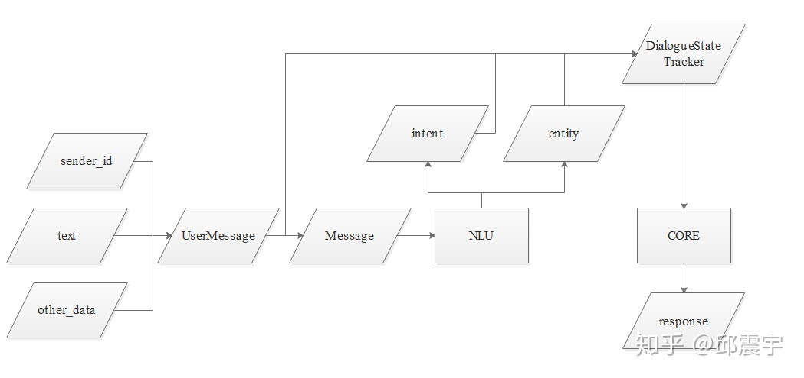
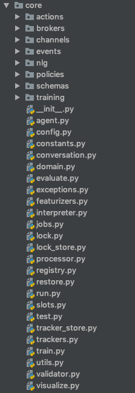
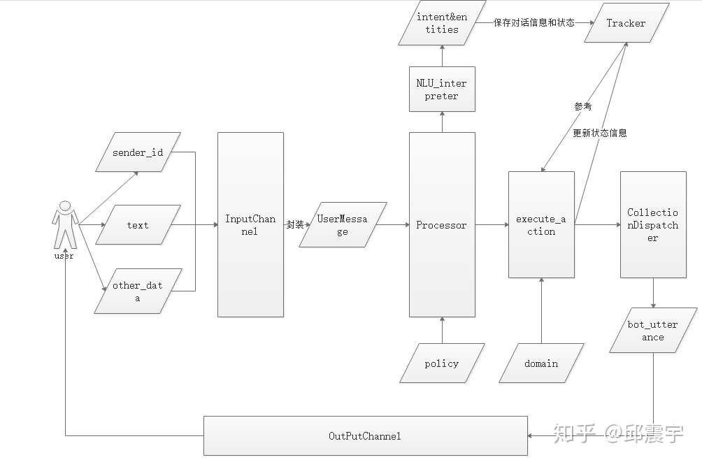

Table of Contents
=================

   * [template](#template)
      * [first-class title](#first-class-title)
         * [second-class title](#second-class-title)
      * [first-class title](#first-class-title-1)
         * [second-class title](#second-class-title-1)

Created by ALTA
# Rasa NLU  
## 阅读说明  

*<font color=#008000>绿色斜体</font>*代表个人的思考理解，*<font color=Yellow>黄色斜体</font>*代表阅读理解过程中的疑问，<font color=Red>红色正体</font>代表关键重要信息，<u>下划线</u>代表次关键重要信息`阴影`或 *一般斜体* 均表示引用或强调 

```python
# ---------------------------------- 输出结果
```

## 参考链接  

1. [Rasa Core开发指南](https://blog.csdn.net/AndrExpert/article/details/92805022)
2. [A Beginner’s Guide to Rasa NLU for Intent Classification and Named-entity Recognition](<https://towardsdatascience.com/a-beginners-guide-to-rasa-nlu-for-intent-classification-and-named-entity-recognition-a4f0f76b2a96>)
3. [基于RASA的task-orient对话系统解析](<https://zhuanlan.zhihu.com/p/75517803>)

## 概述  

NLU和对话管理为核心内容，除核心内容外，rasa当然还提供其他功能，如response生成，与<font color=Red>其他对话系统前端平台对接的接口</font>，以及不同类型的<font color=Red>对话模拟接口</font>（包括shell命令行模式，restful api调用模式等）

## 整体流程  

 

由图可知，当一条用户的表达到达<font color=Red>chatbot</font>时，由NLU对封装后的Message进行文本分析，得到意图和实体信息，然后由对话管理核心模块接受原始的用户消息和NLU的分析结果，根据一些策略，生成某个回复

 ## 术语  

### component  

在我们做任何自然语言处理的任务时，不止是用单纯模型去做一些分类或者标注任务，在此之前，有相当一部分工作是对文本做一些预处理工作，包括但不限于：分词（尤其是中文文本），词性标注，特征提取（传统ML或者统计型方法），词库构建等等。在rasa中，这些不同的预处理工作以及后续的意图分类和实体识别都是通过单独的组件来完成，因此component在NLU中承担着完成NLU不同阶段任务的责任。component类型大致有以下几种：tokenizer，featurizer，extractor，classifier。当然还有emulators，这个主要用于进行对话仿真测试。**组件是服务于NLU的，与DM无关**

意图：An intent represents the purpose of a user's input. You define an intent for each type of user request you want your application to support  

### pipeline  

如何将组件按部就班，井然有序地拼装起来，并正常工作呢？pipeline的好处在于可以合理有序管理不同任务阶段的不同组件工具

# Rasa Core  

## 模块结构  



- actions,该包下面主要存放的是action具体的实现类。action是chatbot执行的一些动作。
- channels,该包下面主要存放的是rasa与前端平台进行对接的接口。因为rasa本身只提供对话系统的功能服务，具体还需要与用户在前端界面进行交互，这个包里定义了不同的接口和不同平台进行对接。例如，console.py，定义了最简单的直接在shell命令行中进行对话交互的接口。
- events，这个是rasa中定义的chatbot能执行的最小粒度的动作。与action有一些关系，我们可以通过action调用不同的events来实现不同的操作。events的实例有“SlotSet”(槽位填充),"Restarted"（重启对话，将所有状态重置）等等。
- nlg，rasa的response生成模块，即生产chatbot返回给用户的消息。目前，rasa支持通过模板生成话术，也支持通过machine learning的方式做NLG。nlg模块中定义了方法读取domain.yml中的预定义的话术模板，然后生成具体的消息。
- policies，此模块是rasa_core最上层的对话管理控制模块。该包中，定义了不同类型的对话管理策略，rasa将依据这些策略，执行不同actions，完成多轮对话任务。这些策略包括人工规则策略如form_policy,memoization等，也包括通过机器学习、深度学习进行训练得到策略模型，如sklearn_policy,keras_policy等。
- schemas，这里主要放置rasa_core的配置文件domian.yml，这个配置文件主要配置槽位定义，实体定义，话术模板，使用的actions的名称定义以及其他系统配置。开发者在开发自己的对话系统时，需要自定义这个配置文件来覆盖源码中预定义的配置。
- training,这里主要存放的是如何将准备的数据转化为对话系统可训练的转化方法以及可视化方法。

根路径上也有很多重要的类文件，重要的如下：

- agent，这是rasa_core专门设计的一个接口，可以将其视作bot主体，主要作用是封装和调用rasa中最重要的一些功能方法，包括上述提到的几个包里的功能模块。
- featurizers: 这个文件主要是定义了一些方法将对话数据特征化，目的是为了将对话数据用于机器学习的训练。
- interpreter: 这个方法是rasa_core与rasa_nlu的一个纽带，rasa管理模块通过定义interpreter类方法，调用rasa_nlu中的parser方法来对用户的发送到bot的消息文本进行实体抽取、意图识别等操作。
- processor：定义了MessageProcess类，供agent调用，功能是有序得调用不同对话功能组件，例如调用interpreter解析用户文本、调用本轮对话的action完成一些操作、根据policy得到下一步的action、记录对话状态等。
- trackers：这个也是rasa中比较重要的一个对象，它的作用是rasa对话系统中的状态记录器，每一轮对话中，对话的状态信息都会进行更新并保存在这个对象中。例如当前已填充的槽位、用户最后一次发送的文本、当前用户的意图等等。

## 整体流程  



## 基本术语  

### InputChannel和OutputChannel  

OutputChannel封装了chatbot需要返回给用户的信息，需要注意，chatbot返回的消息不一定是纯文本，还可能是html，json，文件附件等等，因此需要OutputChannel这个统一接口进行封装处理，因此chatbot可以支持让用户进行点选功能（当然，前提是前端界面支持点选的适配）。 
InputChannel主要负责<font color=Red>将用户输入连同用户的身份信息封装成UserMessage对象</font>，方便后面的Processor处理。对应的，如果在上一轮对话中，OutputChannel是点选或者其他非单纯文本输出，那么本轮对话中的InputChannel也需要接受用户点选或者其他非单纯文本的输入，封装成最终的UserMessage

### UserMessage  

在rasa中，用户发送到chatbot的所有对话内容(*<font color=#008000>参考API，可以通过POST请求发送</font>*)，都需要被封装在一个对象中，这个对象就是Message.而在整个rasa工作流中，存在两个不同的message封装对象，一个是UserMessage，另一个是Message。其中UserMessage是最上层的封装对象，即直接接收用户从某个平台接口传送过来的消息。而Message则是当用户消息流到NLU模块时，将用户消息进行封装。

```python
class UserMessage:
    """Represents an incoming message.

     Includes the channel the responses should be sent to."""

    DEFAULT_SENDER_ID = "default"

    def __init__(
        self,
        text: Optional[Text] = None,
        output_channel: Optional["OutputChannel"] = None,
        sender_id: Optional[Text] = None,
        parse_data: Dict[Text, Any] = None,
        input_channel: Optional[Text] = None,
        message_id: Optional[Text] = None,
        metadata: Optional[Dict] = None,
    ) -> None:
        """Creates a ``UserMessage`` object.

        Args:
            text: the message text content.
            output_channel: the output channel which should be used to send
                bot responses back to the user.
            sender_id: the message owner ID.
            parse_data: rasa data about the message.
            input_channel: the name of the channel which received this message.
            message_id: ID of the message.
            metadata: additional metadata for this message.

        """
```

可以看到作为贯穿整个rasa_core处理流程的用户消息对象，它的成员结构还是比较清晰的，包括了用户发送的文本，定义的OutputChannel类型，用户的id，parse_data(主要存放用户自己定义的实体键值对，开发调试用),inputChannel类型，以及message的id。

### Policy  

对话管理策略是多轮对话系统的核心功能，相当于对话系统的大脑，它负责根据当前用户的反馈，告诉Processor(*<font color=Yellow>什么是Processor？</font>*)当前轮对话中需要采取的后续action，以及如何更新对话状态信息等。rasa支持人工规则(*<font color=#008000>如Form policy</font>*)的策略，也支持机器学习、深度学习得到的数据驱动策略(*<font color=#008000>data-driven</font>*)  
以Form_policy为例，这个策略是一种表单策略，对应的rasa预置了一种类型的action，叫form的action。这种action会将所有槽位作为表单的属性column，每一轮对话，都会去主动询问用户，引导用户将这些表单的属性填充，直到所有属性填充完成。而form_policy的核心就是检索当前是否配置了form类型的action，如果是，则将下一步的action置为form。有关action的描述将在后面详细给出。可以看出这是一个典型的人工规则策略

### Processor  

这个对象是对话系统的核心处理模块。它通过execute_action完成bot处理对话的流程。

这里需要注意一点，在processor执行action之前，agent将会调用processor的log_message方法，使用nlu_interpreter来对用户发送的文本做实体识别和意图识别，然后将信息保存在tracker中，*<font color=#008000>即execute_action的数据来源有两个，一个从Processor，一个从tracker</font>*  

execute_action方法核心内容如下：

```python
    async def execute_action(
        self,
        sender_id: Text,
        action_name: Text,
        output_channel: OutputChannel,
        nlg: NaturalLanguageGenerator,
        policy: Text,
        confidence: float,
    ) -> Optional[DialogueStateTracker]:

        # we have a Tracker instance for each user
        # which maintains conversation state
        tracker = self._get_tracker(sender_id)  ## 获取对话状态历史信息
        if tracker:
            action = self._get_action(action_name)
            await self._run_action(
                action, tracker, output_channel, nlg, policy, confidence
            )																		## 执行action

            # save tracker state to continue conversation from this state
            self._save_tracker(tracker)					## 保存更新对话状态
        else:
            logger.warning(
                "Failed to retrieve or create tracker for sender "
                "'{}'.".format(sender_id)
            )
        return tracker
```

该模块涉及的核心对象有两个，action和tracker（当然还有其他对象如OutputChannel,policy等）

1. DialogueStateTracker  

   在多轮对话过程中全程记录对话状态信息。这个对象在开发自己的对话系统时，作用可是非常大的。很多对话状态信息，都可以从它这里得到。当然， 我们并不能直接去读写其定义的成员变量信息，需要通过其成员方法来操作成员变量，例如current_sate()

2. Action  

   前面已经说到，event对象是rasa中定义的chatbot能执行的最小粒度的动作。而Action则是比event更高层次的对象，会根据用户发送过来的消息，执行一些操作，这些操作可以是自定义的一些逻辑，也可以是系统预置的events。rasa中，action可以分为三大类：

  - **utterance actions**：直接发送文本给用户，action文本模板是在domain.yml中进行定义。
  
  - **custom actions**: 自定义action，由开发者自定义功能的action。个人认为这个是功能最强大的action，因为开发自由度很大，支持使用任何开发语言进行开发。最后只需要将其打包成一个restful服务接口暴露出来即可。因此这种action是可以和对话主系统分离部署的。下面给出自定义action server与bot agent和用户的交互流程图：
  - **default action**: rasa系统内置的粒度较小的action

### domain  

这个对象的数据来自于前述章节提到的配置文件domain.yml。该对象定义不同的方法，从配置文件domain.yml读取槽位模板，话术模板，定义的action名称,自定义的policy名称等信息，并封装到domain对象中。domain对象可以在action执行时为其提供槽位信息以及话术模板等字段  

设计domain的好处在哪儿呢？  

个人认为主要是方便管理对话系统需要使用的模板信息。这里的模板信息包含定义的槽位，意图、实体、话术模板、自定义action、自定义policy。如果需要添加或者修改这些信息，只需要修改domain.yml里面的信息就可以了，不需要去修改任何代码，让配置和代码解耦

### 常见问题  

1. 服务所需训练模型从哪里获取？  

   有3种方式：本地、云端、Webserver， 详细参考: [fetching model](<https://rasa.com/docs/rasa/user-guide/running-the-server/#fetching-models-from-a-server>)

2. 对话记录的持久化  

   用户的会话记录通过Tracker对象记录，默认在内存保留，可以实现持久化，通过配置即可实现

3. 自定义action  

   自定义action需要通过webserver实现，webserver实现restful服务接口即可，自定义action可采用官方的rasa-core-sdk实现。

4. 用户验证管理 

   Rasa支持配置用户验证管理，使用的是基于JWT的用户权限验证功能(此部分待研究) 

   

### 训练 

### 服务

1. 

Rasa向action server发送包含执行哪个action信息`POST`请求([execute-actions-in-other-code](<https://rasa.com/docs/rasa/core/actions/#execute-actions-in-other-code>)），请求规范[参考](<https://rasa.com/docs/rasa/api/action-server/#action-server>)

## Rasa Core消息处理流程(slots的处理？)  

1. 将用户输入的Message传递到Interpreter(NLU模块)，该模块负责识别Message中的"意图(intent)“和提取所有"实体”(entity)数据；
2. Rasa Core会将Interpreter提取到的意图和识别传给Tracker对象，该对象的主要作用是跟踪会话状态(conversation state)；
3. 利用policy记录Tracker对象的当前状态，并选择执行相应的action，其中，这个action是被记录在Track对象中的；
4. 最后，将执行action返回的结果输出即完成一次人机交互

## Custom actions  

CustomAction，即自定义action，允许开发者执行任何操作并反馈给用户，比如简单的返回一串字符串，或者控制家电、检查银行账户余额等等。它与DefaultAction不同，**自定义action需要我们在domain.yml文件中的actions部分先进行定义，然后在指定的webserver中实现它，其中，这个webserver的url地址在endpoint.yml文件中指定**，并且这个webserver可以通过任何语言实现，当然这里首先推荐python来做，毕竟Rasa Core为我们封装好了一个rasa-core-sdk专门用来处理自定义action. custom actions在Rasa中的**使用方式并不是直接调用，而是采用服务的形式**，所以如果想使用自定义的action，还需要定义一个endpoints.yml文件，文件内容如下：

```python
action_endpoint:
  url: 'http://localhost:5055/webhook'
```

在启动会话的时候添加额外的命令--endpoints endpoints.yml，该命令会在5055端口启动一个服务，这个服务就是我们定义的action

## NLU training data format(markdown)  

训练数据包括以下类型：common examples，synonyms，regex features，lookup tables

```python
## intent:check_balance
- what is my balance <!-- no entity -->
- how much do I have on my [savings](source_account) <!-- entity "source_account" has value "savings" -->
- how much do I have on my [savings account](source_account:savings) <!-- synonyms, method 1-->
- Could I pay in [yen](currency)?  <!-- entity matched by lookup table -->

## intent:greet
- hey
- hello

## synonym:savings   <!-- synonyms, method 2 -->
- pink pig

## regex:zipcode
- [0-9]{5}

## lookup:currencies   <!-- lookup table list -->
- Yen
- USD
- Euro

## lookup:additional_currencies  <!-- no list to specify lookup table file -->
path/to/currencies.txt
```

### common examples - Intents  

starting with `##`, specify intent with ## intent:name_of_intent followed by a list of questions for the intent

```python
## intent:goodbye
- bye
- goodbye
- see you around
- see you later
- talk to you later
```

### common examples - Entity  

specify the entity inside each of the question as follow `[value](name of entity)`

```python
## intent:ask_shop_open
- does the shop open on [monday](weekday)
- does the shop open on [wednesday](weekday)
- does the shop open on [friday](weekday)
```

### Lookup table  

a long list of values for a single entity

```python
## lookup:currencies   <!-- lookup table list -->
- Yen
- USD
- Euro

## lookup:countries  <!-- no list to specify lookup table file -->
path/to/countries.txt
"""
In the countries.txt, you can specify each of the element in a new line as follow
singapore
malaysia
vietnam
indonesia
thailand
"""
```

**you have to provide a few examples for it to generalize**

```python
## intent:inform_country_of_origin
- i am from [malaysia](countries)
- i am from [vietnam](countries)
- i came from [thailand](countries)
```

### Synonym  

identify synonym and map it back to a single value. The first method is to add it inline like `[synonym1](entity:value)`

```python
## intent:ask_eaten
- what did you have for [breakfast](meal)
- what did you have for [break fast](meal:breakfast)
- what did you have for [breakfat](meal:breakfast)
```

The second method is as follow：

```python
## synonym:breakfast
- brekfast
- brokefast
```

What makes synonym differs from lookup table is that **synonym will map the value of the entity to a single value (breakfast in this example)**. In other words, synonym is great for catching spelling mistakes and acronym while lookup table is great for generalizing the examples

### Regex  

```python
## intent:inform_zipcode
- my zipcode is [12345](zipcode)
- my zipcode is [33456](zipcode)
- my zipcode is [94056](zipcode)
## regex:zipcode
- [0-9]{5}
```

## Stories 

### Data format  

1. story title  

   仅仅起描述作用

2. user messages  

   starting with `*` in the format `intent{"entity1": "value", "entity2": "value"}`

3. action  

   starting with `-`

4. events  

   Events returned by an action are on lines immediately after that action. For example, if an action returns a `SlotSet` event, this is shown as `slot{"slot_name": "value"}`

## config.yaml  

### language  

语言

### pipeline  

组件

### policy  

Rasa-core使用的策略

## domain.yaml  

`机器的知识库`

### intents  
你期望用户说的东西
### entities  
您想要从消息中提取的信息片段。
### actions  
你的机器人可以做和说的东西
### slots  
在会话期间跟踪的信息（例如用户年龄）
### templates  
你的机器人可以说的东西的模板字符串

## Actions  

1. Utterance actions  

   start with `utter_` and send a specific message to the user


### second-class title  

1. Number-prefix class  
   - Symbol-prefix class
   - 